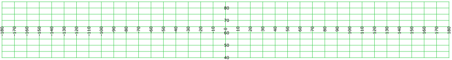
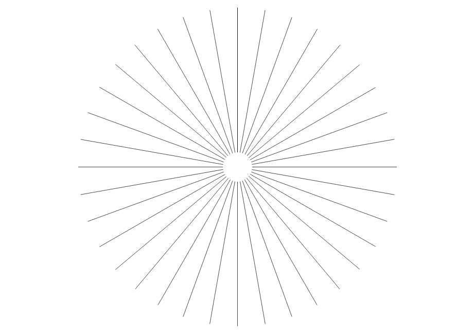
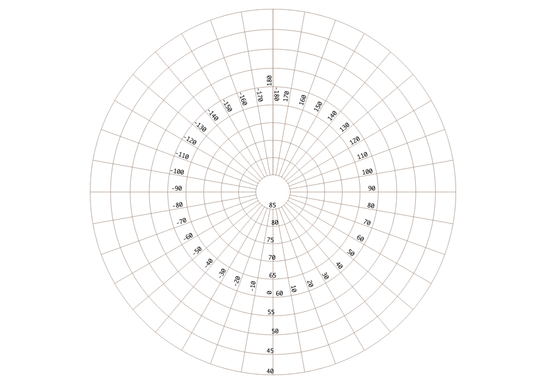

## Graticules
Open QGIS, and create a grid, using "Vector/Research Tools/Vector Grid".
Let's create a grid to wrap around the North pole:
xmin:-180°, xmax:180°, ymin:40°, ymax:85°. Set the X step to 10° and the Y step to 5°, and save the file as lines to a shapefile.
Tip: to show labels, tick-off the option "Discourage labels from covering features" in the layer style. To have the labels written every 20°, you can edit the condition to label the layer like this:

CASE WHEN ( COORD = (2 * toint(COORD / 2)) ) THEN COORD END

We will change the projection from EPSG:4326 to EPSG:3995.
Projecting directly the grid did not give me satisfying result:

My interpretation is that the start and end points in the initial grid are merged into a single point in the circumpolar projection. My solution is to densify the original grid.

For now, the shapefile has node only where the line horizontal and vertical lines intersect. After reprojection, the grid will look line a spider web. To have something closer to circles, we must add more points along each line, to have its re-proejcted shape closer to a circle. Just use, "Vector/Geometry tools/Densify geometry using an interval" (that's a GRASS module) and just set to 1 the interval: a new node is added every 1°.

Now, it is time to reproject the grid to a polar projection. Just open the processing tool box and search for "reproject", then select "Vector/general tools/reproject layer". Choose your target SRS (I set it to EPSG:3995, but you may prefer another projection), reproject, et voilà!

Do not forget to uncheck option "Discourage labels from covering features" in the labels style.

If the reprojected file is automatically opened in the QGis project, it will be reprojected on-the-fly to the current CRS, which is probably EPSG:4326. Open a new project, then open your newly projected file, and you see it in its polar projection. The polar grid is shows nice circular rings.

## World
You can get a shapefile of the world countries from geocommons.
If you reproject to a polar projection, you will see the date line as a disgracious line.
Toolbox/geoalgorithms/Geometry operations/Transform shapes.
Then shift the shapefile by 360° (set dX to 360°). We will just need to re-attach the corner of Russia. For now, the shifted shapefile is a multi-part polygon: transform it so that it is made of many single part polygons, so they the unwanted polygons can be selected and removed.
Now we need to merge Russia's polygons into a single one. For that, use the Vector merge tool.
Then, we need to get ride of the disgracious inner boundary: use "dissolve by attribute". Be sure to select some attribute, and uncheck option "keep inner boundaries".

Job done! Now, you just need to reproject to a polar projection (re-open in a new project to have a nice view).
